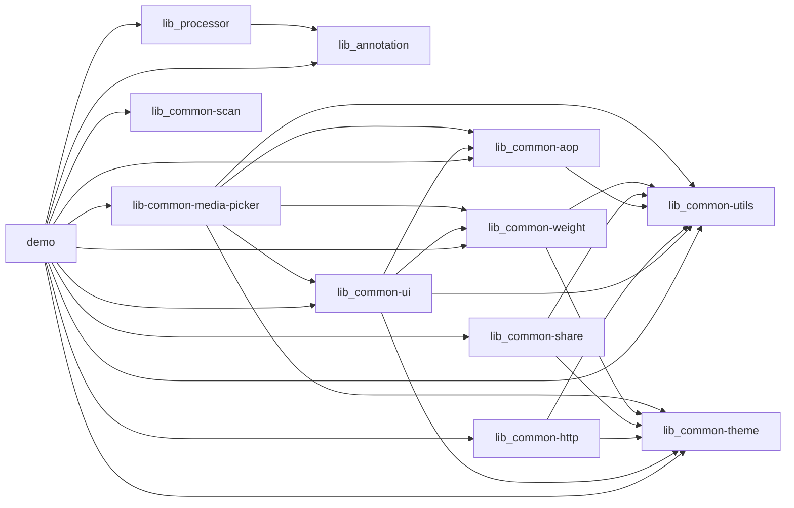

# AndroidProject

AndroidProject 是一个多模块 Android 示例项目，以 `demo` 工程演示公共模块组合后的业务能力，同时沉淀了通用 UI、网络、工具、主题、控件、AOP、分享、图片选择、二维码扫描和登录注解处理等可复用能力。项目当前包含一个 `demo` 集成应用，以及多组可复用 common library。模块代码以 Kotlin 为主，UI 层基于 ViewBinding。

## 模块结构

| 模块 | 类型 | 说明 |
| --- | --- | --- |
| `demo` | Android Application | 项目唯一的应用工程，集成并演示各 common 模块组合后的能力（网络请求、WebView、二维码扫描、图片选择、分享、URL Scheme、登录 Hook 等）。 |
| `lib_annotation` | Java Library | 登录流程 APT 使用的注解定义模块。 |
| `lib_processor` | Java Library | 登录注解处理器，基于 AutoService 和 JavaPoet 生成登录 Hook 辅助代码。 |
| `lib_common-theme` | Android Library | 全局 Application 基类和主题基础能力。 |
| `lib_common-utils` | Android Library | 通用工具集合（Kotlin），包含权限、缓存、Toast、DataStore、设备/签名、键盘、日志、状态栏、刷新、富文本等工具。 |
| `lib_common-weight` | Android Library | 自定义控件集合，目前主要沉淀标题栏、状态栏和单选组等相关控件。 |
| `lib_common-ui` | Android Library | Activity/Fragment/ViewModel 基类、ViewBinding 页面容器、页面状态和换肤基础封装。 |
| `lib_common-http` | Android Library | Retrofit/OkHttp 网络层、Cookie、缓存拦截器、下载、Room、Moshi/Gson 解析等。 |
| `lib_common-aop` | Android Library | AspectJ 切面能力，包含防重复点击、网络检查、权限检查等注解和切面。 |
| `lib_common-share` | Android Library | QQ、微信、微博和自定义渠道分享能力封装。 |
| `lib-common-media-picker` | Android Library | 图片/相册选择能力，包含相册浏览、图片预览与多选等。 |
| `lib_common-scan` | Android Library | 二维码扫描能力，基于相机预览与微信 QRCode/OpenCV 实现。 |

## 构建环境

- Android Gradle Plugin: `8.13.0`
- Kotlin: `2.2.20`
- Compile SDK: `35`
- Target SDK: `35`
- Min SDK: `24`
- JDK: Java 17

常用验证命令：

```bash
JAVA_HOME=/Users/dian/Library/Java/JavaVirtualMachines/corretto-17.0.16/Contents/Home ./gradlew :demo:assembleDebug
```

## 本地配置

敏感配置通过 `local.properties` 或环境变量读取。可参考 `local.properties.example` 添加签名、蒲公英、乐固、通知 webhook 和演示登录账号。

示例：

```properties
signing.release.storeFile=../keystore/project.keystore
signing.release.keyAlias=
signing.release.storePassword=
signing.release.keyPassword=

demo.login.username=
demo.login.password=
```

## 模块依赖关系



## 开发约定

- 新业务优先沉淀到 common 模块，再由 `demo` 组合使用。
- 网络、UI 基类、权限、分享等通用能力优先使用 common 模块实现，减少业务工程内重复代码。
- 新增代码优先使用 Kotlin，UI 层使用 ViewBinding。
- 敏感信息不要写入源码，使用 `local.properties` 或 CI secret。
- 新增模块后同步更新根目录 README 和对应模块 README。
