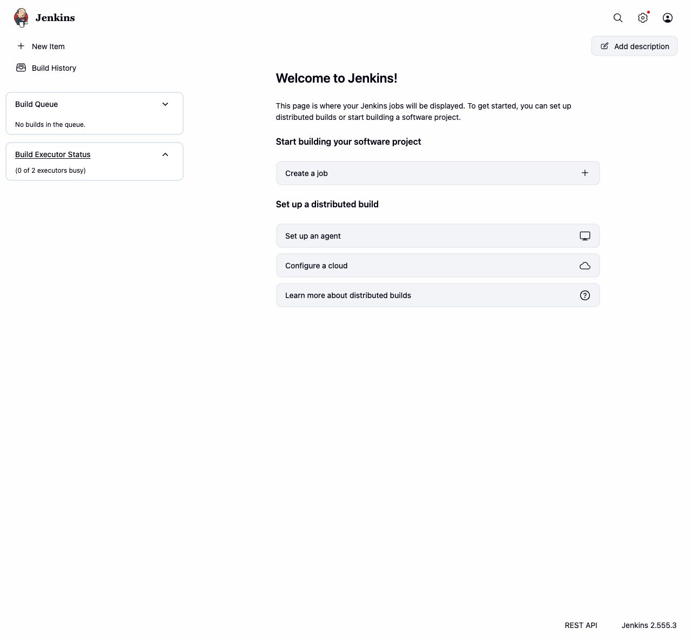
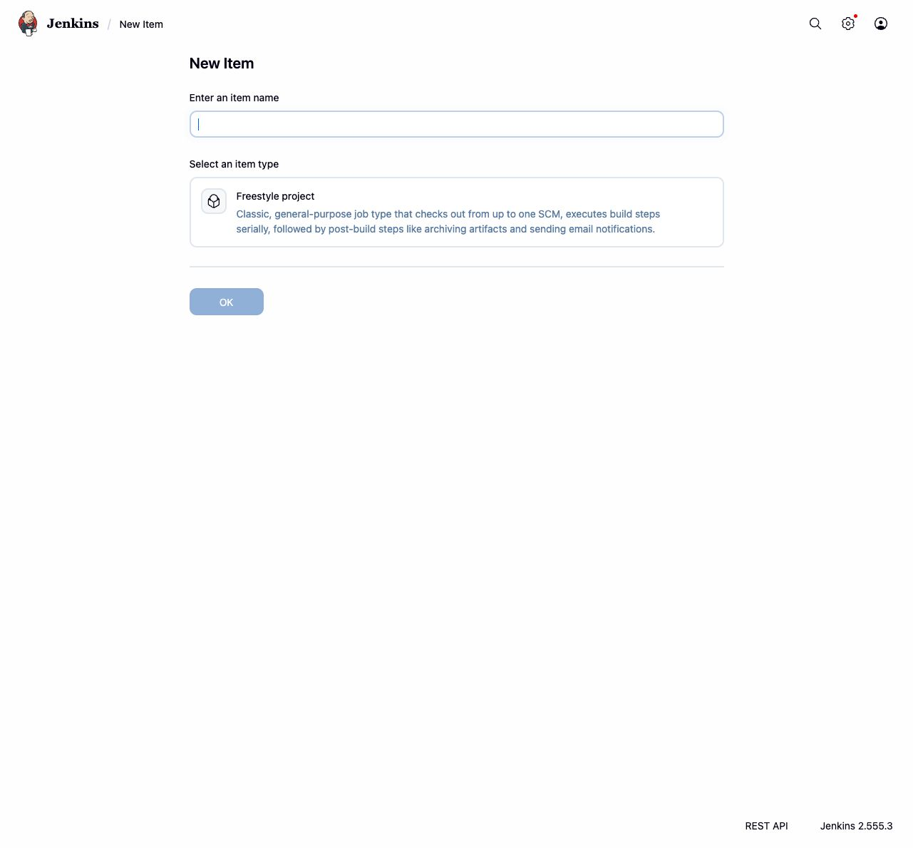
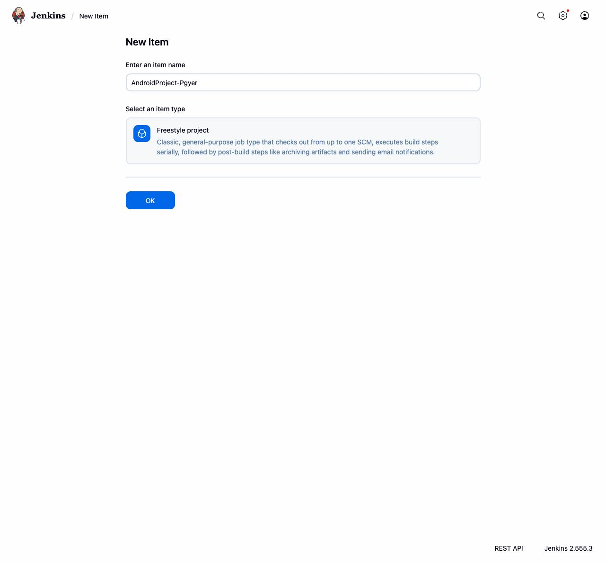
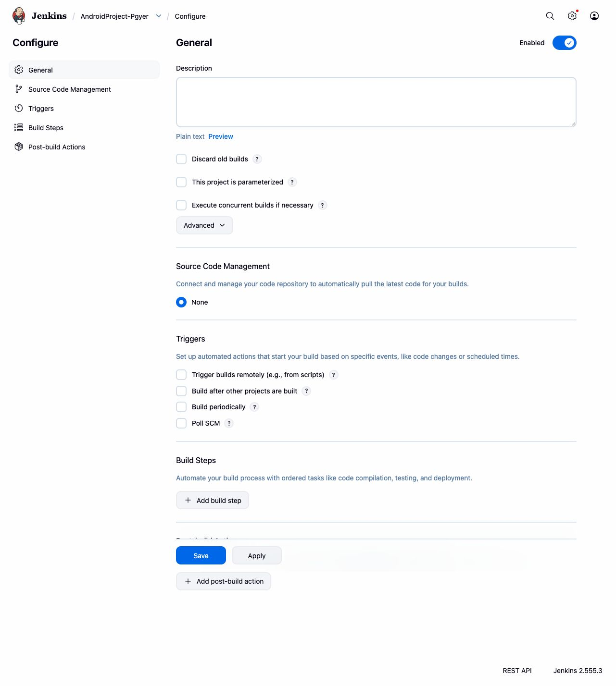
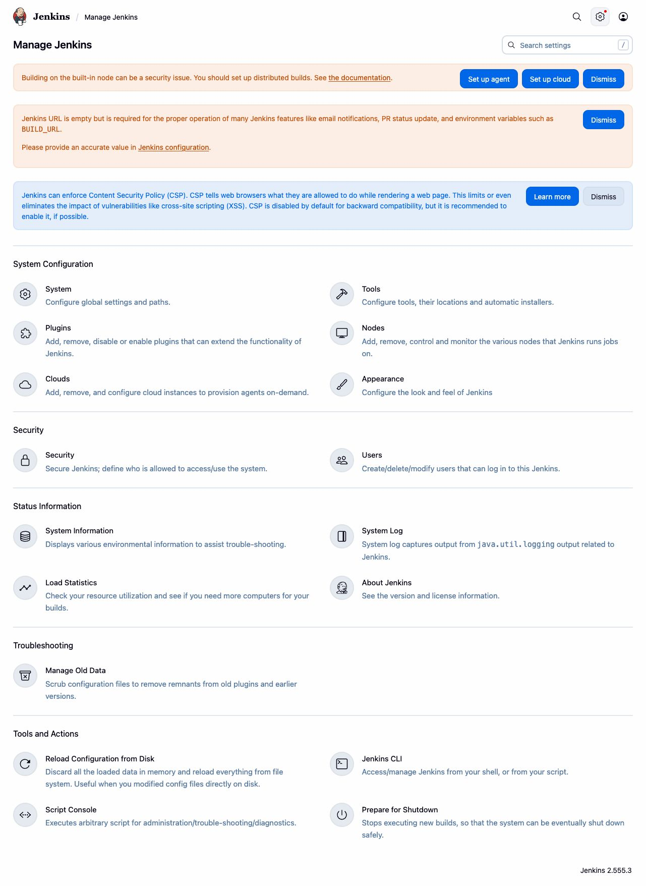
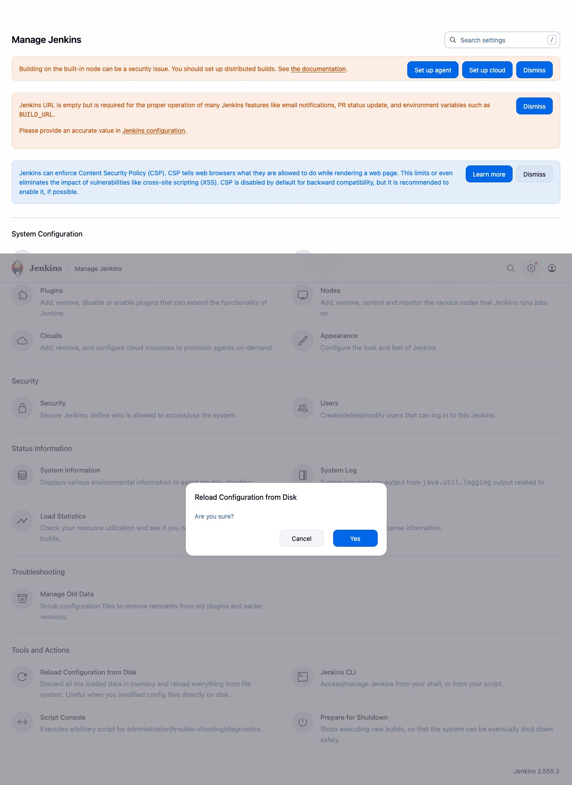
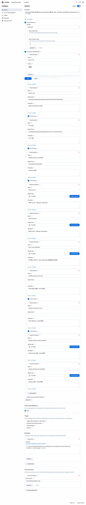
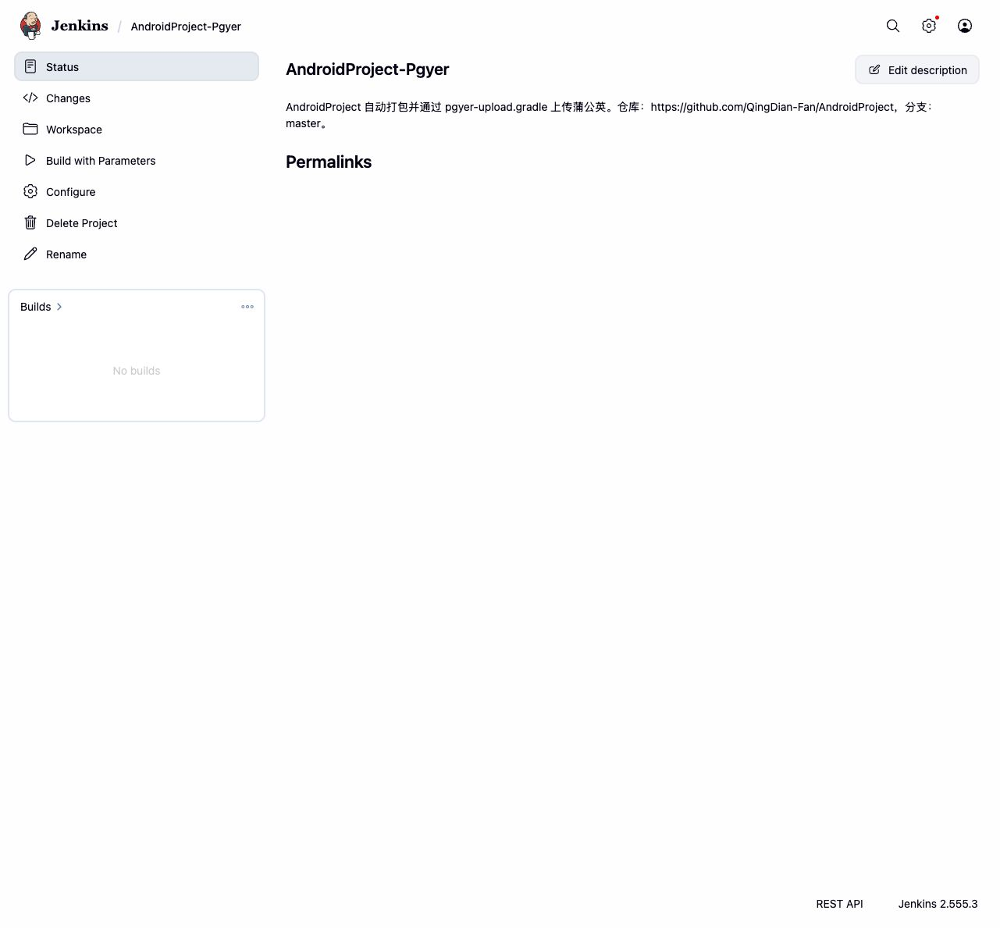
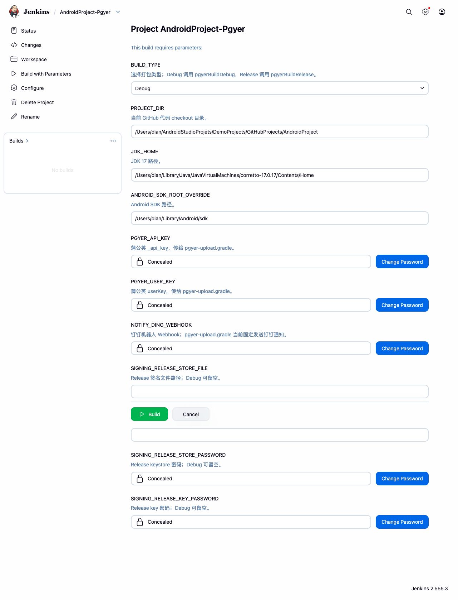

# Jenkins 自动打包上传蒲公英配置说明

本文记录在本机 Jenkins `http://localhost:8080/` 中配置 `AndroidProject-Pgyer` 自动打包任务的完整过程。当前 Jenkins 只安装了 Freestyle Project 类型，未看到 Pipeline 类型，所以本次采用 Freestyle + Shell 的方式执行仓库里的 `jenkins/pgyer-build.sh`，最终仍然调用 `pgyer-upload.gradle` 中的 `pgyerBuildDebug` / `pgyerBuildRelease`。

## 基本信息

- Jenkins 地址：`http://localhost:8080/`
- Jenkins 任务名：`AndroidProject-Pgyer`
- GitHub 仓库：`https://github.com/QingDian-Fan/AndroidProject`
- 打包分支：`master`
- 本机项目目录：`/Users/dian/AndroidStudioProjets/DemoProjects/GitHubProjects/AndroidProject`
- JDK 17 地址：`/Users/dian/Library/Java/JavaVirtualMachines/corretto-17.0.17/Contents/Home`
- Android SDK 默认地址：`/Users/dian/Library/Android/sdk`
- Jenkins 构建脚本：`jenkins/pgyer-build.sh`
- Jenkins 任务配置备份：`jenkins/AndroidProject-Pgyer.config.xml`

## Jenkins 配置步骤截图

### 1. 打开 Jenkins 首页



### 2. 新建任务



### 3. 填写任务名并选择 Freestyle project



### 4. 进入任务配置页



### 5. 从磁盘重新载入 Jenkins 配置

因为任务配置已写入本机 `~/.jenkins/jobs/AndroidProject-Pgyer/config.xml`，需要在 Jenkins 中执行 `Reload Configuration from Disk`。






### 6. 确认任务配置已生效

配置页已经包含以下参数：

- `BUILD_TYPE`
- `PROJECT_DIR`
- `JDK_HOME`
- `ANDROID_SDK_ROOT_OVERRIDE`
- `PGYER_API_KEY`
- `PGYER_USER_KEY`
- `NOTIFY_DING_WEBHOOK`
- `SIGNING_RELEASE_STORE_FILE`
- `SIGNING_RELEASE_KEY_ALIAS`
- `SIGNING_RELEASE_STORE_PASSWORD`
- `SIGNING_RELEASE_KEY_PASSWORD`

构建步骤为：

```bash
cd /Users/dian/AndroidStudioProjets/DemoProjects/GitHubProjects/AndroidProject
/bin/bash ./jenkins/pgyer-build.sh
```



### 7. 打开任务详情页



### 8. 打开 Build with Parameters



## 构建参数填写说明

Debug 包最少需要以下配置。可以在 Jenkins 参数里填写，也可以复用项目根目录 `local.properties` 里的同名配置；脚本会优先让 Gradle 按项目现有的 `readLocalOrEnv` 逻辑读取配置。

- `BUILD_TYPE`：选择 `Debug`
- Jenkins 参数 `PGYER_API_KEY` 或 `local.properties` 中的 `pgyer.apiKey`
- Jenkins 参数 `PGYER_USER_KEY` 或 `local.properties` 中的 `pgyer.userKey`
- Jenkins 参数 `NOTIFY_DING_WEBHOOK` 或 `local.properties` 中的 `notify.dingWebhook`

当前 `pgyer-upload.gradle` 的 `getMsgChannel()` 固定返回 `dingding`，因此上传成功后会发送钉钉通知。

Release 包额外需要填写：

- Jenkins 参数 `SIGNING_RELEASE_STORE_FILE` 或 `local.properties` 中的 `signing.release.storeFile`
- Jenkins 参数 `SIGNING_RELEASE_KEY_ALIAS` 或 `local.properties` 中的 `signing.release.keyAlias`
- Jenkins 参数 `SIGNING_RELEASE_STORE_PASSWORD` 或 `local.properties` 中的 `signing.release.storePassword`
- Jenkins 参数 `SIGNING_RELEASE_KEY_PASSWORD` 或 `local.properties` 中的 `signing.release.keyPassword`

`JDK_HOME` 已默认配置为：

```text
/Users/dian/Library/Java/JavaVirtualMachines/corretto-17.0.17/Contents/Home
```

## 构建流程

Jenkins 执行 `jenkins/pgyer-build.sh` 后，会按下面流程运行：

```bash
cd /Users/dian/AndroidStudioProjets/DemoProjects/GitHubProjects/AndroidProject
git fetch origin master
git checkout master
git pull --ff-only origin master
chmod +x ./gradlew
./gradlew --no-daemon clean pgyerBuildDebug
```

当 `BUILD_TYPE=Release` 时，最后一步会改为：

```bash
./gradlew --no-daemon clean pgyerBuildRelease
```

## GitHub 自动触发说明

任务已配置远程触发 token：

```text
androidproject-pgyer-token
```

本机 Jenkins 当前地址是 `localhost`，GitHub 不能直接访问。如果要让 GitHub webhook 自动触发，需要先把 Jenkins 部署到公网服务器，或通过内网穿透提供一个 GitHub 可访问的 HTTPS 地址。

Webhook 可配置为请求：

```text
https://你的Jenkins域名/job/AndroidProject-Pgyer/buildWithParameters?token=androidproject-pgyer-token&BUILD_TYPE=Debug
```

如果 Jenkins 开启登录鉴权后 GitHub 仍无法触发，建议在服务器版 Jenkins 上安装 GitHub / Generic Webhook Trigger 等插件，或使用 Jenkins API Token 配合受控的 webhook 中转服务。

## 本次验证结果

已执行以下验证：

```bash
bash -n jenkins/pgyer-build.sh
JAVA_HOME=/Users/dian/Library/Java/JavaVirtualMachines/corretto-17.0.17/Contents/Home ./gradlew --no-daemon tasks --group pgyer
```

Gradle 已确认存在 `pgyerBuildDebug` 和 `pgyerBuildRelease` 任务。

## 已处理过的失败

如果控制台日志出现：

```text
Missing required Jenkins parameter/env: PGYER_API_KEY
```

原因是旧版脚本只检查 Jenkins 参数，没有兼容项目根目录 `local.properties`。新版 `jenkins/pgyer-build.sh` 已改为同时支持 Jenkins 参数和 `local.properties`。
