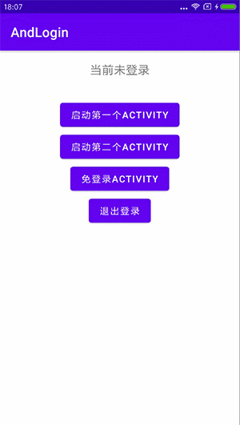
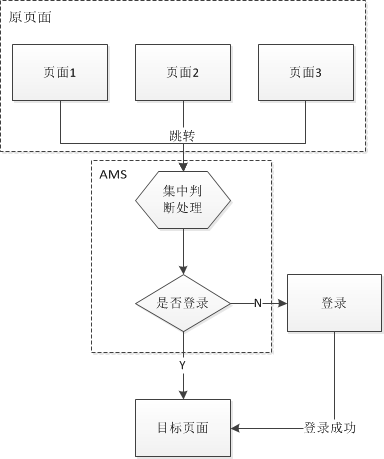

# lib_processor

`lib_processor` 是登录流程的注解处理器模块，类型为 Java Library。它基于 `lib_annotation` 中的注解，在编译期扫描登录页面、需要登录的页面和登录态判断方法，并生成集中式登录 Hook 辅助代码。

## 模块定位

- 扫描 `@RequireLogin`、`@LoginPage`、`@CheckLogin` 注解。
- 使用 JavaPoet 生成登录辅助类，减少业务页面中分散的登录判断逻辑。
- 配合 Hook AMS 的方式，在用户未登录时跳转登录页，登录完成后回到原目标页面。

## 核心依赖

- `lib_annotation`: 注解定义。
- `auto-service`: 注册 Java annotation processor。
- `javapoet`: 生成 Java 源码。

## AndLogin

效果如下：




**优势：**

1. 以非侵入性的方式将分散的登录判断逻辑集中处理，减少了代码量，提高了开发效率。
2. 增加或删除目标页面时无需修改判断逻辑，只需增加或删除其对应注解即可，符合开闭原则，降低了耦合度
3. 在用户登录成功后直接跳转到目标界面，保证了用户操作不被中断。



## 使用方式

1，添加依赖

```groovy


dependencies {
    implementation project(':lib_annotation')
    kapt project(':lib_processor')
}
```

2，给需要登录的Activity添加注解

```kotlin
@RequireLogin
class TodoListActivity : BaseAppBindActivity<ActivityTodoListBinding>() {
	...
}
```

3，给登录Activity添加注解

```java
@LoginActivity
class LoginActivity : BaseAppBindActivity<ActivityLoginBinding>() {
	...
}
```

4，提供判断是否登录的方法

需要是一个静态方法

```java
object LoginUtil {
@CheckLogin
@JvmStatic
fun isLogin(): Boolean {
    val cookies = AppDataStore.getData("www.wanandroid.com", "")
    val cookie: String = cookies.ifEmpty { "" }
    return cookie.isNotEmpty()
}
}
```
